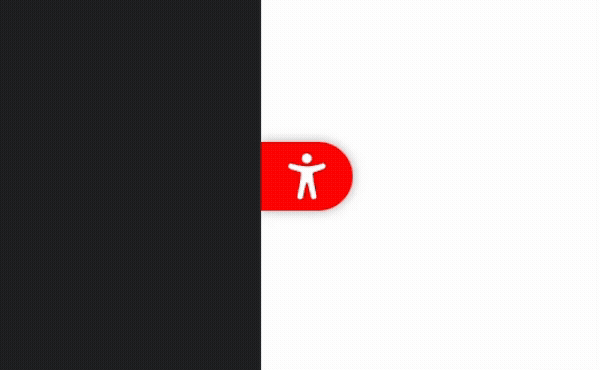

# React Mini Floating Action Button

[](https://www.npmjs.com/package/react-mini-fab) [](https://cateiru.github.io/react-mini-fab/)

A lightweight and customizable Mini Floating Action Button (Mini FAB) component for React applications. This component provides an easy way to add a floating action button to your UI, enhancing user interaction and accessibility.



## Features

- **Draggable** - Vertically draggable with position persistence via localStorage
- **Smooth Animations** - Elegant show/hide animations and position transitions
- **Flexible Positioning** - Support for left and right screen positions with animated switching
- **Badge Support** - Optional badge indicator for notifications or status
- **Highly Customizable** - Configurable colors, icons, and accessibility labels
- **TypeScript Support** - Full TypeScript type definitions included
- **Lightweight** - Minimal dependencies and optimized bundle size
- **Accessibility First** - Built with ARIA labels and keyboard navigation support

## Installation

Install the package using your preferred package manager:

```bash
npm install react-mini-fab
```

```bash
yarn add react-mini-fab
```

```bash
pnpm add react-mini-fab
```

## Usage

Here's a basic example of how to use the MiniFAB component:

```tsx
import { MiniFAB } from 'react-mini-fab';

import 'react-mini-fab/style.css';

function App() {
  return (
    <MiniFAB
      onClick={() => console.log('FAB clicked!')}
      position="right"
      title="Help"
      ariaLabel="Open help window"
      backgroundColor="#007bff"
      draggableId="help-fab"
    >
      <svg width="24" height="24" viewBox="0 0 24 24">
        {/* Your icon SVG */}
      </svg>
    </MiniFAB>
  );
}
```

## Props API

### MiniFABProps

| Prop | Type | Required | Default | Description |
|------|------|----------|---------|-------------|
| `onClick` | `() => void` | No | - | Callback function invoked when the button is clicked |
| `isHide` | `boolean` | No | `false` | Controls the visibility of the button. When `true`, the button is hidden |
| `title` | `string` | No | - | Tooltip text displayed when hovering over the button |
| `ariaLabel` | `string` | **Yes** | - | Accessibility label for screen readers |
| `backgroundColor` | `string` | **Yes** | - | Background color of the button (any valid CSS color) |
| `position` | `"left" \| "right"` | No | `"left"` | Position of the button on the screen |
| `draggableId` | `string` | No | - | Unique identifier for the draggable functionality. When provided, the vertical position is saved to localStorage |
| `badge` | `Badge` | No | - | Badge configuration to display on the button |
| `includeFixedClassName` | `boolean` | No | `false` | Whether to include fixed class names for custom styling purposes |
| `children` | `React.ReactNode` | No | - | Content to be rendered inside the button (typically an icon or text) |

### Badge

| Prop | Type | Required | Description |
|------|------|----------|-------------|
| `color` | `string` | **Yes** | Background color of the badge (any valid CSS color) |

## Examples

### With Badge Indicator

```tsx
<MiniFAB
  onClick={() => console.log('Notification clicked')}
  position="right"
  ariaLabel="Notifications"
  backgroundColor="#ff6b6b"
  draggableId="notification-fab"
  badge={{ color: "#00ff00" }}
>
  <NotificationIcon />
</MiniFAB>
```

### Dynamic Position Switching

```tsx
function App() {
  const [position, setPosition] = useState<"left" | "right">("left");

  return (
    <>
      <button onClick={() => setPosition(position === "left" ? "right" : "left")}>
        Toggle Position
      </button>
      <MiniFAB
        position={position}
        ariaLabel="Settings"
        backgroundColor="#9b59b6"
        draggableId="settings-fab"
      >
        <SettingsIcon />
      </MiniFAB>
    </>
  );
}
```

### Show/Hide Control

```tsx
function App() {
  const [isHidden, setIsHidden] = useState(false);

  return (
    <>
      <button onClick={() => setIsHidden(!isHidden)}>
        {isHidden ? 'Show' : 'Hide'} FAB
      </button>
      <MiniFAB
        isHide={isHidden}
        ariaLabel="Help"
        backgroundColor="#3498db"
        draggableId="help-fab"
      >
        <HelpIcon />
      </MiniFAB>
    </>
  );
}
```

### With Custom Text

```tsx
<MiniFAB
  onClick={() => console.log('Chat opened')}
  ariaLabel="Open chat"
  backgroundColor="#2ecc71"
  draggableId="chat-fab"
>
  <span style={{ color: '#fff', fontWeight: 'bold' }}>Chat</span>
</MiniFAB>
```

## Accessibility

This component is built with accessibility in mind:

- **ARIA Labels**: The `ariaLabel` prop is required to ensure screen readers can properly identify the button's purpose
- **Keyboard Navigation**: The FAB is fully keyboard accessible using standard button interactions
- **Focus Indicators**: Clear focus outlines for keyboard navigation
- **Semantic HTML**: Uses proper `<button>` element for interactive functionality
- **Tooltip Support**: Optional `title` prop provides additional context on hover

## Development

This library is built using modern tooling and best practices:

### Build

```bash
pnpm run build
```

The build process generates both UMD and ES module formats:

- UMD: `dist/index.umd.cjs` (for CommonJS environments)
- ES Module: `dist/index.js` (for modern bundlers)
- TypeScript definitions: `dist/index.d.ts`

### Testing

```bash
# Run tests
pnpm run test

# Run tests with UI
pnpm run test:ui

# Run tests with coverage
pnpm run test:coverage
```

### Storybook

View and interact with component examples:

```bash
# Start Storybook dev server
pnpm run dev:storybook

# Build Storybook
pnpm run build:storybook
```

### Code Quality

```bash
# Lint and format with Biome
pnpm run check:write
```

## LICENSE

[MIT](./LICENSE)
